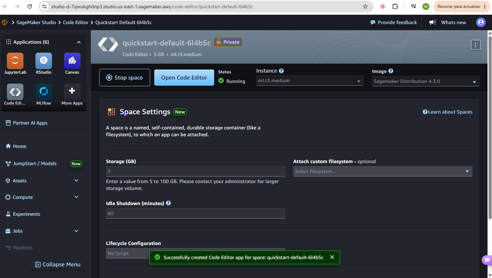
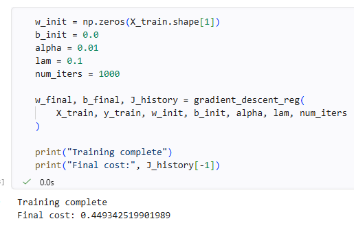
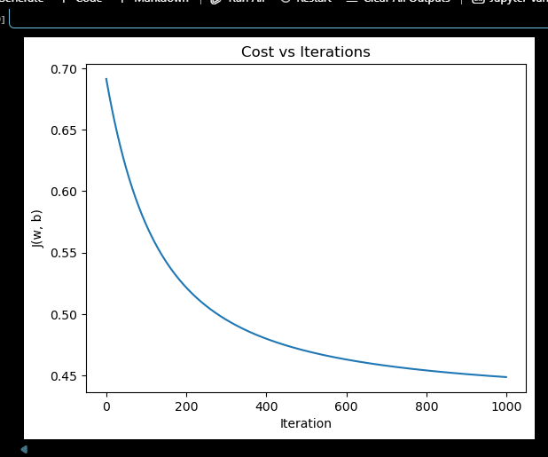
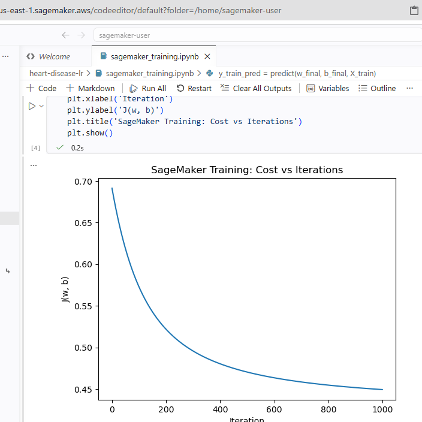
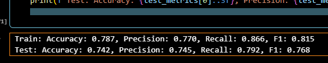
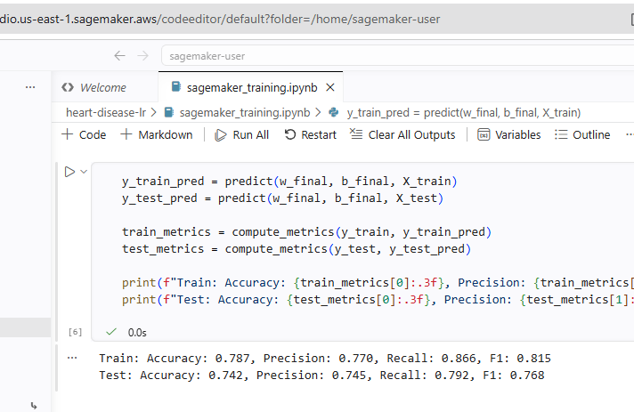

# Heart Disease Risk Prediction with Logistic Regression

### Mariana Malagón

## Exercise Summary
This project implements logistic regression from scratch to predict heart disease risk, without using scikit-learn to train the model. It includes an exploratory data analysis of the dataset, a full implementation of the sigmoid function, the cost function and gradient descent, visualization of decision boundaries for different feature pairs, L2 regularization with different values of lambda, and finally training and testing the same model inside Amazon SageMaker.

## Dataset Description
The dataset used is the Heart Disease dataset from Kaggle: https://www.kaggle.com/datasets/johnsmith88/heart-disease-dataset

It contains patient records with 14 clinical features, such as age, sex, chest pain type, resting blood pressure, cholesterol, fasting blood sugar, resting electrocardiographic results, maximum heart rate achieved, exercise induced angina, ST depression, the slope of the peak exercise ST segment, number of major vessels, and thalassemia test result. The target column indicates whether the patient has heart disease (1) or not (0).

The raw CSV had 1025 rows, but only 302 of those were unique patients, the rest were exact duplicates. After removing duplicates and a few rows with disguised missing values in the ca and thal columns, the final dataset used for training had 296 patients.

## Repository Contents
- `heart_disease_lr_analysis.ipynb`: the full notebook with all 5 steps of the assignment.
- `data/heart.csv`: the original dataset downloaded from Kaggle.
- `data/train_data.csv` and `data/test_data.csv`: the preprocessed train and test data exported for use in SageMaker.
- `images/`: screenshots used as evidence of the SageMaker training and testing process.

## SageMaker Evidence
The preprocessed train and test CSVs were uploaded to a SageMaker Studio Code Editor space (`ml.t3.medium` instance, `Sagemaker Distribution 4.3.0` image). A new notebook was created there with the same sigmoid, cost, gradient and gradient descent functions used locally, trained with lambda = 0.1, alpha = 0.01 and 1000 iterations.

Environment configuration:

Training completed successfully:

## Comparison with Local Execution
The cost curve and final metrics obtained in SageMaker were compared directly against the local run, side by side:

**Cost vs iterations**

| Local | SageMaker |
|---|---|
|  |  |

**Test set metrics**

| Local | SageMaker |
|---|---|
|  |  |

The test metrics obtained in SageMaker (accuracy 0.742, precision 0.745, recall 0.792, F1 0.768) were identical to the ones obtained locally, which confirms the implementation behaves consistently across environments. No endpoint was created or deployed at any point, since the assignment only allows using SageMaker for training and testing.
